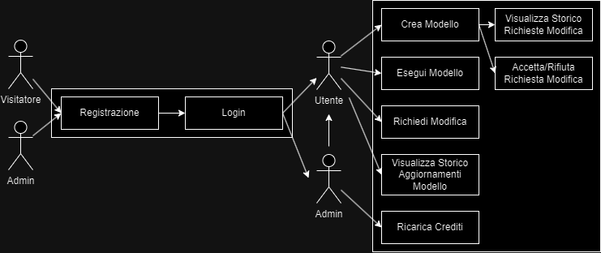
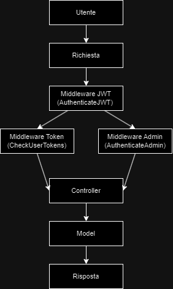

# Sistema di Ottimizzazione su Grafo

Il progetto "Sistema di Ottimizzazione su Grafo" è un'applicazione web progettata lato back-end per gestire modelli di ottimizzazione su grafi. Utilizza l'algoritmo A* per calcolare i percorsi ottimali tra nodi, permettendo agli utenti di creare ed eseguire i modelli di ottimizzazione ed effettuare e gestire le richieste di modifica, in base al credito residuo degli utenti. L'applicazione è costruita utilizzando Node.js, Express e Sequelize per l'interazione con un database PostgreSQL.

## Diagramma dei Casi d'Uso

Il seguente diagramma rappresenta i casi d'uso del "Sistema di Ottimizzazione su Grafo". Gli attori principali del sistema includono il Visitatore, l'Amministratore (Admin) e l'Utente.

- **Visitatore**: può registrarsi e accedere al sistema.
- **Utente**: una volta registrato, ha accesso a diverse funzionalità, tra cui la creazione di modelli, l'esecuzione di modelli e la richiesta di modifiche. Inoltre, può visualizzare lo storico degli aggiornamenti del modello e ricaricare i propri crediti.
- **Admin**: gestisce le richieste di modifica degli utenti, con la possibilità di accettarle o rifiutarle. Inoltre, può visualizzare lo storico delle richieste di modifica.

<div align="center">



*Figura 2: Caso d'Uso.*

</div>

## Patterns Utilizzati

### 1. Model-View-Controller (MVC)

Nel progetto "Sistema di Ottimizzazione su Grafo", il pattern MVC è stato implementato in questo modo, senza l'utilizzo della view:
- **Models**: Le classi User, OptimizationModel e ModificationRequest rappresentano i modelli, gestendo le interazioni con il database utilizzando Sequelize.
- **Controllers**: Le classi come UserController, OptimizationController e AdminController gestiscono la logica di business, elaborando le richieste degli utenti e comunicando con i modelli.
- **Routes**: Le rotte definiscono come le richieste HTTP siano mappate ai controller, divise in userRoutes ed optimizationRoutes.

### 2. Singleton

Il pattern Singleton è un pattern creazionale che garantisce che una classe abbia una sola istanza e fornisce un punto di accesso globale a quella istanza.

Nel progetto, il pattern Singleton è stato utilizzato per la classe Database, che gestisce la connessione al database PostgreSQL. La classe Database ha un metodo statico getInstance() che restituisce un'istanza unica di Sequelize. Se l'istanza non esiste, viene creata una nuova istanza; altrimenti, viene restituita l'istanza esistente. Questo approccio garantisce che l'applicazione utilizzi sempre la stessa connessione al database.

### 3. Chain of Responsibility (CoR)

Il pattern Chain of Responsibility permette di passare una richiesta lungo una catena di gestori. Ogni gestore decide se elaborare la richiesta o passarla al successivo.

Nel progetto, il pattern CoR è stato implementato per gestire i middleware nella nostra applicazione Express, come mostrato nella figura 2. È stata creata una classe MiddlewareChain che consente di aggiungere gestori (handler) alla catena. Ogni handler è responsabile per l'elaborazione della richiesta e può decidere di passare la richiesta al successivo nella catena. Questo approccio consente un flusso di controllo più chiaro e gestisce eventuali errori in modo centralizzato.

<div align="center">



*Figura 2: Middleware.*
</div>

## Test del Progetto

Per testare il progetto, puoi utilizzare la collezione Postman fornita. Clicca sul link qui sotto per scaricare il file JSON:

[Scarica Postman Collection](test/TestProgettoPA.postman_collection.json)

Puoi anche avviare il progetto utilizzando il seguente comando:

```bash
docker-compose up --build

